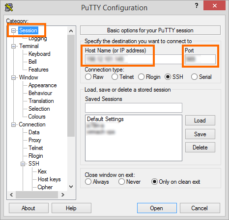
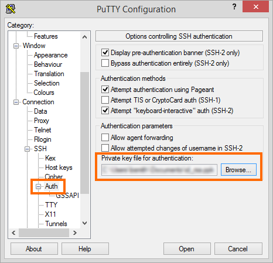
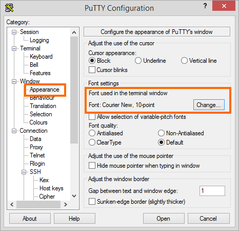
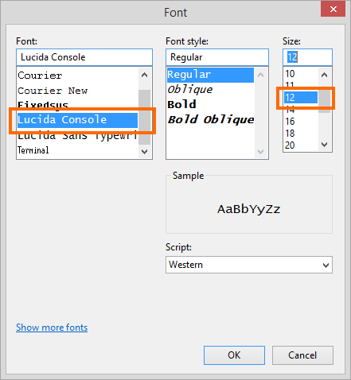
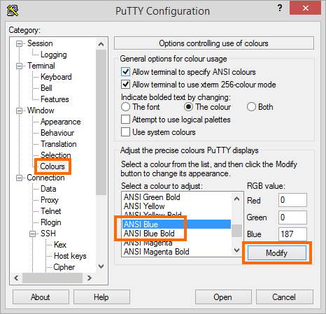
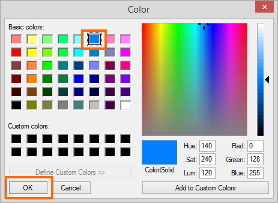
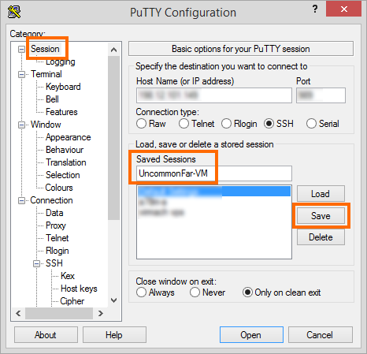
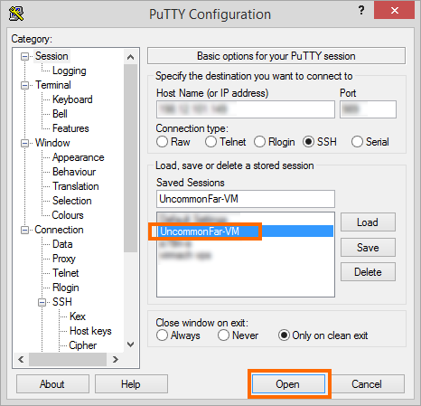
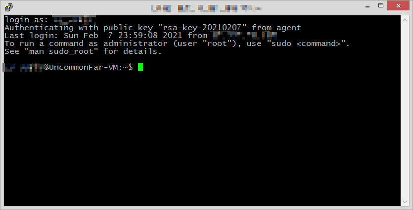

# Connect to server with PuTTY
Download: https://www.chiark.greenend.org.uk/~sgtatham/putty/latest.html

Under **Session**, enter the server IP and SSH port number

Under **Connection** --> **SSH** --> **Auth**, select the path to your Private Key File

PuTTY's default font is hard on the eyes Under **Window** --> **Appearance**, change the font to something that is to your liking.

PuTTY's default color for blue text is hard on the eyes. Under **Window** --> **Colours**, change the color to something that is to your liking.

Go back to **Session**, give your Saved Session a name and click **Save**

Select your new Saved Session and click **Open**

Enter your Linux username and press Enter

