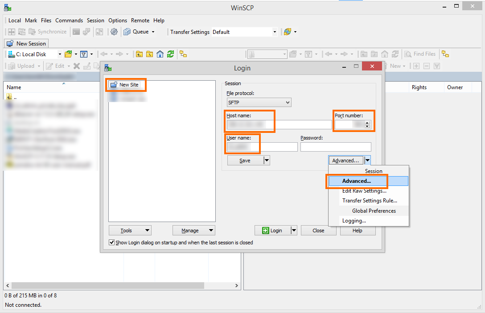
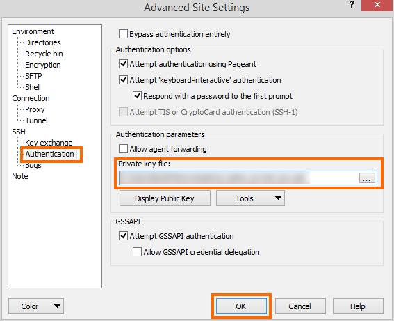
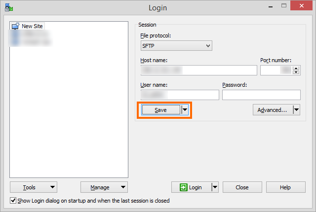
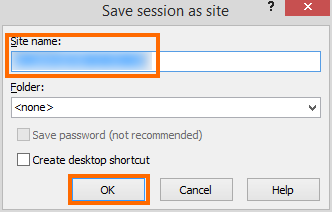
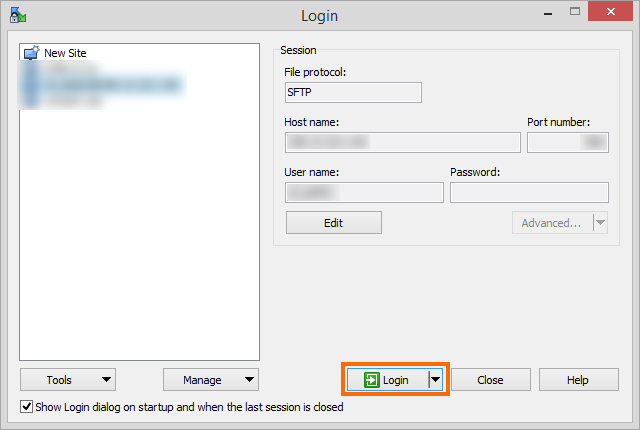

# Connect to server with WinSCP

WinSCP lets you transfer files between your local PC and the server (like FTP).

Download: https://winscp.net/eng/download.php

Click on **New Site**, enter **Host name**, **Port number**, and **User name**. Then click **Advanced** --> **Advanced**

Go to **SSH** --> **Authentication** and select your private key file.

Click **Save**. Give your settings a name and click **OK**

Click **Login**

