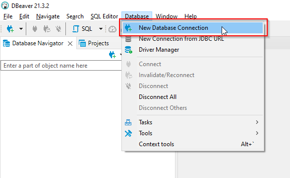
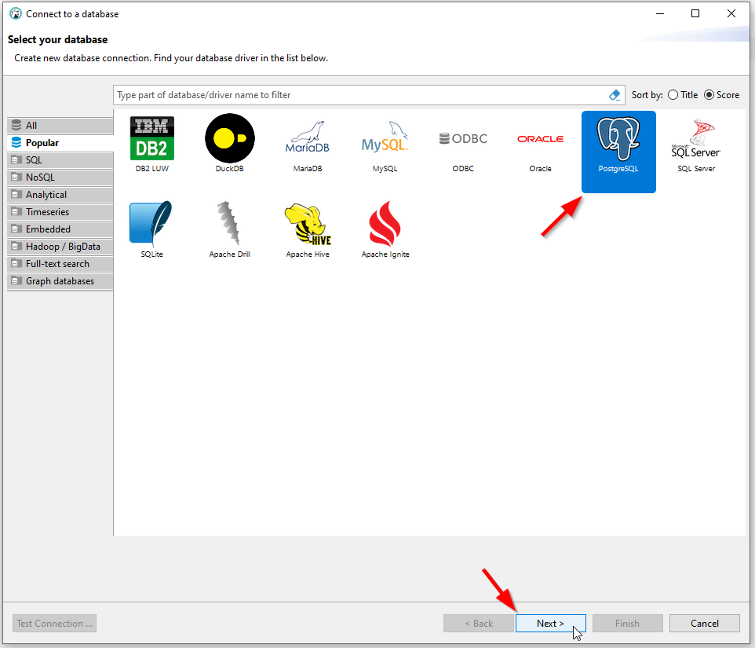
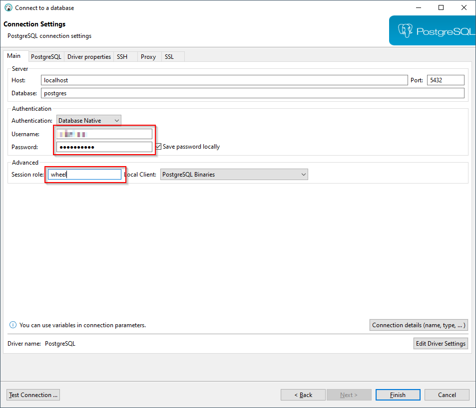
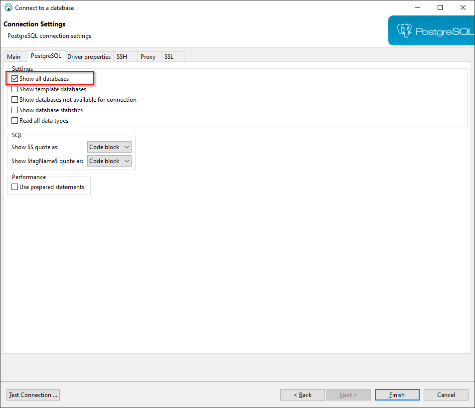
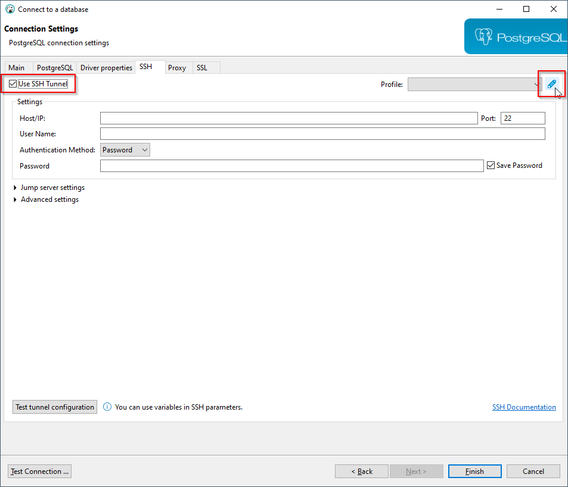
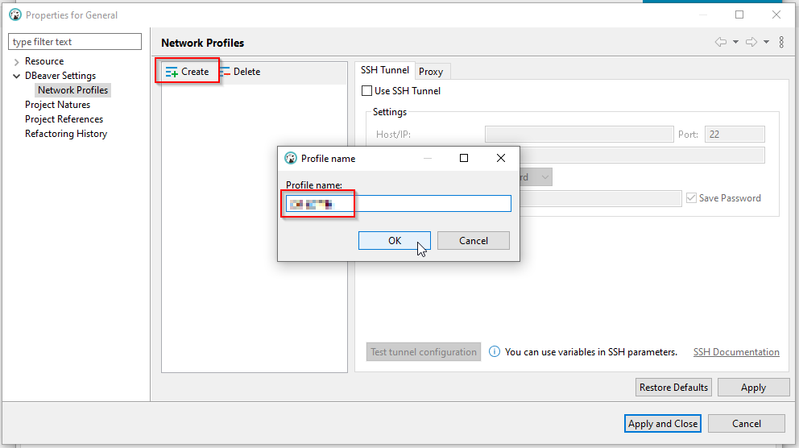
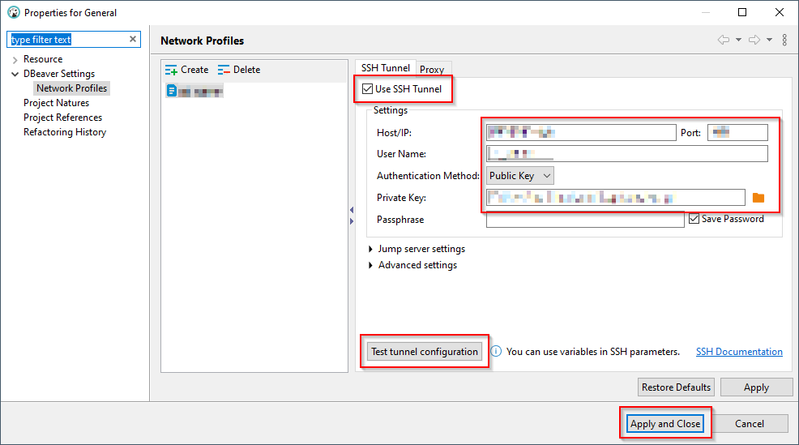
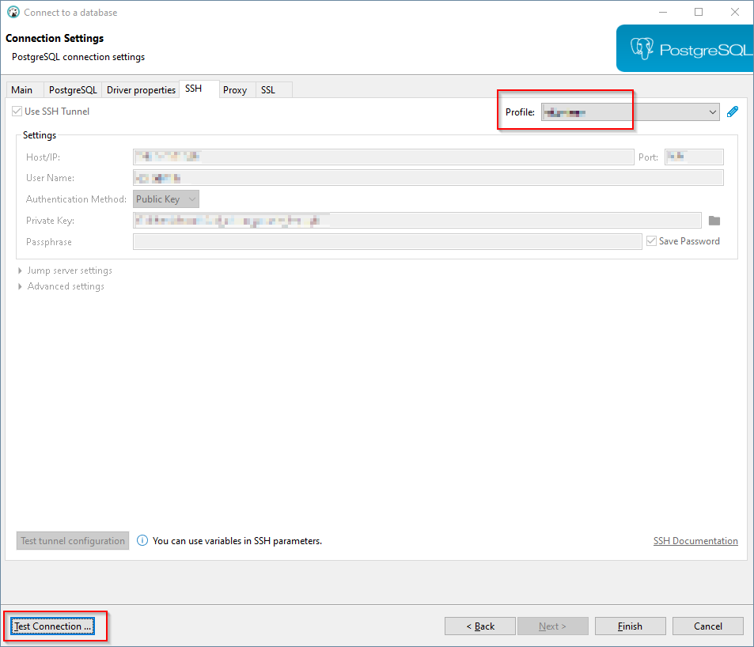
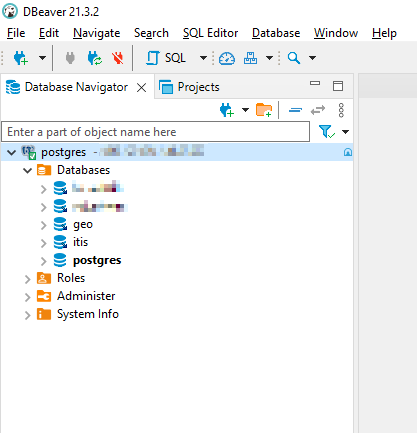

**[< Go back to main page](../../../)**

# Connect to server with DBeaver Community Edition

DBeaver is a free and open source database development environment, which allows you to connect to the database, execute queries, create tables, and more.

Download: https://dbeaver.io/download/

After installing DBeaver, click **Database** -> **New Database Connection**.

Select **PostgreSQL** as the database type and click **Next**.

Enter your Linux username and password. Type in **wheel** for **Session role**.

Switch to the **PostgreSQL** tab and check **Show all databases**.

Switch to the **SSH** tab and check **Use SSH Tunnel**. Click the pencil editing button to create a new SSH profile.

Click **Create** and give your new profile a name.

Check **Use SSH Tunnel**. Enter the server IP address and port. Enter your Linux username. Select **Public Key** for **Authentication Method**. Select the path to your private key file. Click **Test tunnel configuration** to test your SSH settings. If connection was successful, click **Apply and Close**.

Select your newly created profile from the dropdown menu. Click **Test Connection** to test your SSH settings as well as your database connection settings. If connection was successful, click **Finish**.

If everything was setup correctly, you should see the following databases listed under **Database Navigator** (sensitive info was removed from the image below).

**[< Go back to main page](../../../)**